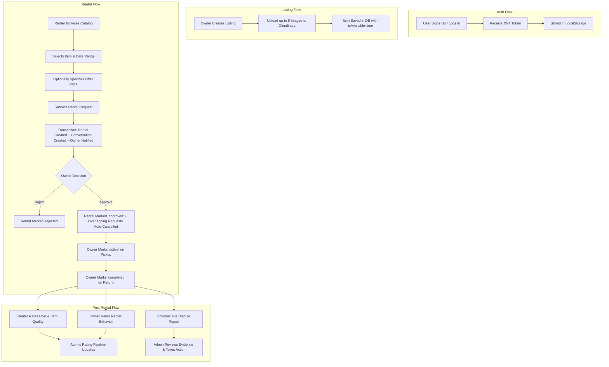
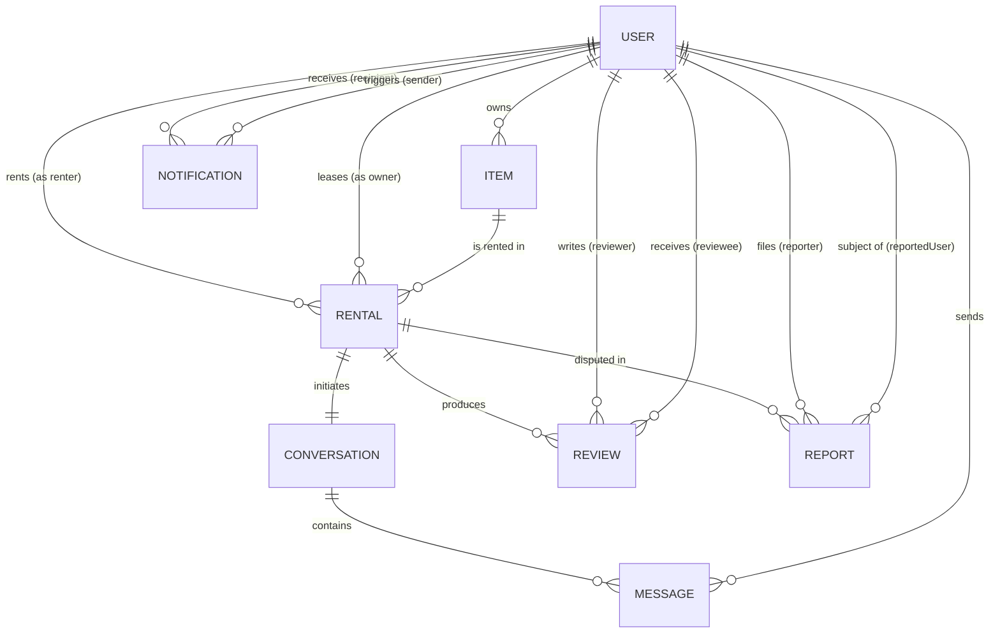
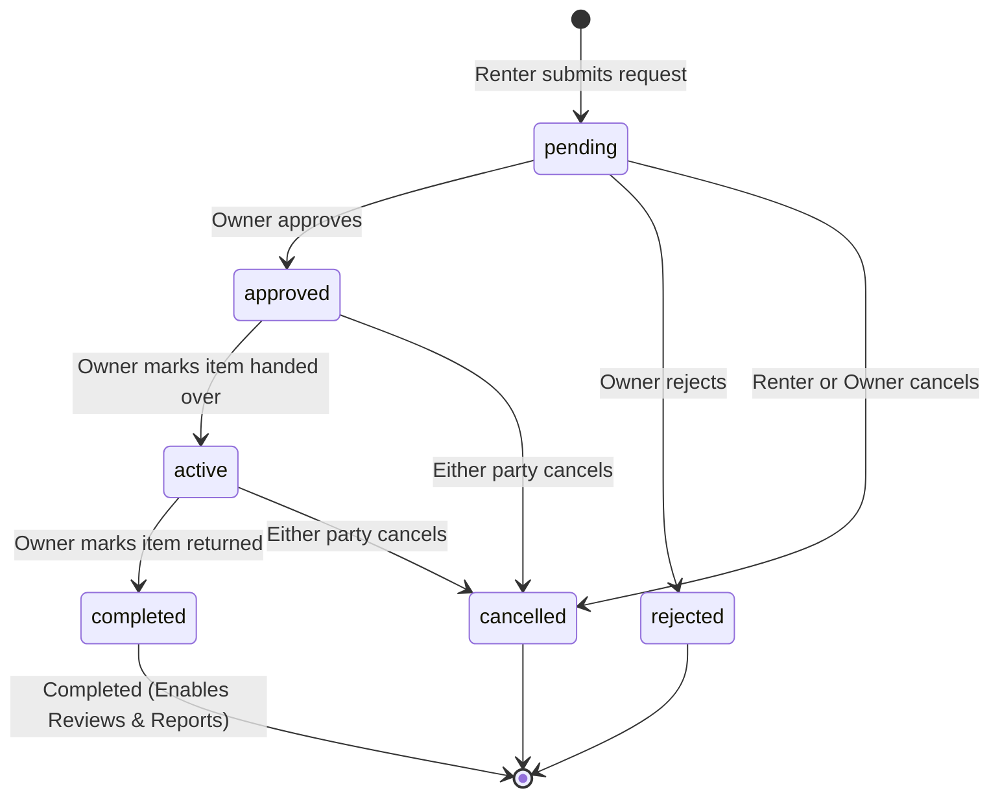

# Technical Audit Report: Rentify Campus Rental Platform

**Date of Audit:** September 1, 2026  
**Auditor Role:** Senior Software Engineer / Solutions Architect  
**Project Name:** Rentify  
**Target Repository:** `/home/swayam/Workspace/Java/Rental_proj/Rentify`  

---

## 1. Project Overview

### 1.1 Application Summary
**Rentify** is a campus-focused peer-to-peer (P2P) resource-sharing and rental web application. It enables university students to list items (e.g., textbooks, electronics, bikes, cameras, lab equipment, instruments), browse and filter items listed by campus peers, negotiate pricing through custom offer bids, send formal rental booking requests, chat in context-bound messaging threads, track rental lifecycle statuses, submit two-way reviews with multi-dimensional rating metrics, receive real-time notifications, and resolve disputes via an administrative moderation workflow.

### 1.2 User Types and Roles
The system distinguishes two primary user roles stored in the `User.role` field:

1. **Student (`student` - Default):**
   - Can register with name, email, password, and campus affiliation.
   - Can list items for rent with descriptions, photos (up to 5), pricing per day, condition, and location.
   - Can edit and delete their own listings (provided no active/approved rentals exist).
   - Can search, filter, and view detailed item pages.
   - Can send rental requests specifying a date range, optional custom offer price, and message.
   - Can manage outgoing rental requests (cancel pending requests).
   - Can manage incoming rental requests as an item owner (approve, reject, mark active, mark completed).
   - Can engage in 1-on-1 chat threads automatically created for each rental booking.
   - Can submit reviews upon rental completion (rating lender behavior + item quality, or rating renter behavior).
   - Can file formal dispute reports with photo evidence against another party regarding a completed rental.
   - Can edit their profile (bio, campus, phone, avatar) and view other student public profiles.

2. **Administrator (`admin`):**
   - Possesses all student privileges.
   - Has access to the protected `/admin` route and `/api/admin/*` endpoints.
   - Can view the master list of all registered users and their reputation metrics.
   - Can execute a "nuclear" user deletion that purges the user, their items, rentals, reviews, messages, conversations, notifications, reports, and remote Cloudinary images.
   - Can view all submitted dispute reports, review evidence photos, send resolution messages to reporters, and execute moderation actions (warning, listing removal, account suspension, or marked resolved).

### 1.3 Main Features
- **User Authentication & Profiles:** JWT-based stateless authentication, bcrypt hashing, profile customization, and public reputation cards.
- **Item Catalog & Marketplace:** Category filtering, keyword text search, condition filtering, price and date sorting, pagination, and multi-image photo gallery with lightbox modal.
- **Rental Transaction Workflow:** Date range calculation, booking conflict & date overlap validation, counter-offer price bidding, and structured status transitions (`pending` → `approved`/`rejected`/`cancelled` → `active` → `completed`).
- **Contextual In-Rental Messaging:** Direct 1-on-1 chat thread created automatically per rental with message read status tracking and unread counter.
- **Multi-Dimensional Rating & Reputation System:** Dual rating calculation distinguishing host behavior, product quality, and renter behavior; atomic incremental updates of rolling averages on User and Item records.
- **In-App Notification Engine:** Real-time event notifications for rental status changes, chat messages, review alerts, and administrative case updates with 30-second frontend polling and unread badges.
- **Dispute Reporting & Admin Moderation:** Complaint filing for completed transactions, evidence upload, admin review queue, and enforcement actions (account suspension, listing removal).
- **Cloud Media Upload:** Direct image uploads to Cloudinary via Multer with validation, automatic image transformation, and URL persistence.

### 1.4 Main User Flows


### 1.5 Current Implementation Completeness Assessment
- **Complete & Fully Functional:**
  - JWT Authentication, password hashing, and user authorization middleware (`authenticate`, `authorizeAdmin`).
  - Item listing CRUD, category search, text indexing, condition filters, and pagination.
  - Multi-image upload to Cloudinary storage via Multer with file size/type validation.
  - Rental booking creation with date range validation and date overlap conflict detection.
  - Rental state machine transitions with role-based permission enforcement.
  - Overlap-based automatic cancellation of conflicting pending rentals upon approval.
  - Automatic conversation initialization linked to rental bookings.
  - Direct chat messaging with read status toggling and unread count aggregation.
  - Multi-tier reputation updates via MongoDB aggregation update pipelines.
  - In-app notification creation, unread badge counting, mark-as-read, and mark-all-read.
  - Dispute filing with photo evidence, admin report moderation, user suspension, and listing takedown.
  - Admin user management and nuclear cascade deletion of all user-associated entities.
- **Incomplete / Missing / Stubs:**
  - **Payment Processing:** No real payment gateway integration (Stripe, Razorpay, Escrow); rental pricing and offer pricing are record-keeping figures only.
  - **Real-Time Push:** Chat and notifications operate via HTTP requests and client polling (30s interval for notifications), lacking WebSockets / Server-Sent Events (SSE).
  - **Missing Seed Script:** `backend/package.json` specifies `"seed": "node src/utils/seed.js"`, but `src/utils/seed.js` does not exist in the repository.
  - **Password Recovery & Email Verification:** No forgot-password, reset-token, or university email verification mechanisms.
  - **Token Revocation / Blacklist:** JWT tokens cannot be invalidated prior to expiry upon logout or password change (suspension check is performed on DB lookup).

---

## 2. Current Tech Stack

| Layer / Concern | Technology / Library | Version | Role / Purpose |
|---|---|---|---|
| **Frontend Framework** | React | `^18.3.1` | Single Page Application (SPA) UI framework |
| **Frontend Build Tool** | Vite | `^5.4.19` | Build tool and development server |
| **Frontend Routing** | React Router DOM | `^6.30.1` | Client-side declarative routing and navigation |
| **Frontend Icons** | Lucide React | `^0.462.0` | UI icon set |
| **Frontend Styling** | Vanilla CSS | Standard CSS3 | Component-level and page-level scoped styles |
| **Backend Runtime** | Node.js | v18+ | JavaScript runtime engine |
| **Backend Framework** | Express.js | `^4.21.2` | REST API routing and HTTP server framework |
| **Database** | MongoDB | 8.x | Document-oriented NoSQL database |
| **ODM / DB Driver** | Mongoose | `^8.9.5` | Object Data Modeling and schema validation |
| **Authentication** | JSON Web Tokens (`jsonwebtoken`) | `^9.0.2` | Stateless Bearer token issuance and verification |
| **Password Hashing** | `bcrypt` | `^5.1.1` | Salt generation (12 rounds) and password hashing |
| **Schema Validation** | `zod` | `^3.24.1` | Runtime request body and environment validation |
| **File / Media Storage** | Cloudinary (`cloudinary`) | `^1.41.3` | Cloud image hosting and on-the-fly transformations |
| **Multipart Uploads** | `multer` & `multer-storage-cloudinary` | `^2.1.1` / `^4.0.0` | Multipart/form-data handler streaming to Cloudinary |
| **Security Headers** | `helmet` | `^8.0.0` | HTTP security response headers |
| **CORS** | `cors` | `^2.8.5` | Cross-Origin Resource Sharing handling |
| **Rate Limiting** | `express-rate-limit` | `^7.5.0` | IP-based request throttling (auth & general API) |
| **HTTP Logging** | `morgan` | `^1.10.0` | Development HTTP request logging |
| **Environment Config** | `dotenv` | `^16.4.7` | `.env` environment variable loader |

---

## 3. Repository Structure

```
Rentify/
├── README.md                           # Project documentation, setup guide, endpoint overview
├── scratch.js                          # Temporary utility test script for Mongoose items query
├── package-lock.json                   # Root package lock placeholder
├── backend/                            # Node.js + Express REST API application
│   ├── .env.example                    # Template environment variables
│   ├── package.json                    # Backend dependencies, scripts, metadata
│   ├── package-lock.json               # Backend dependency lockfile
│   └── src/
│       ├── server.js                   # Entry point: validates env, starts server, connects to DB
│       ├── app.js                      # Express app factory: middleware, routes, error handlers
│       ├── config/
│       │   ├── db.js                   # Mongoose connection setup with SSL/TLS options
│       │   ├── env.js                  # Zod validation schema for environment variables
│       │   └── cloudinary.js           # Cloudinary SDK credentials & Multer storage engine
│       ├── utils/
│       │   ├── apiError.js             # Operational ApiError class with HTTP status codes
│       │   ├── apiResponse.js          # Standardized API response formatters (success, paginated)
│       │   ├── catchAsync.js           # Async controller wrapper forwarding errors to next()
│       │   ├── cloudinary.utils.js     # Helpers for URL parsing and Cloudinary image destruction
│       │   └── constants.js            # Categories, conditions, rental statuses, pagination defaults
│       ├── middlewares/
│       │   ├── auth.js                 # JWT Bearer token verification and req.user attachment
│       │   ├── admin.js                # Role check restricting routes to admin users
│       │   ├── validate.js             # Middleware applying Zod schema validation to req.body
│       │   ├── rateLimiter.js          # express-rate-limit instances for auth and API routes
│       │   └── errorHandler.js         # Centralized error handler converting errors to JSON
│       ├── models/
│       │   ├── index.js                # Barrel export for all 8 Mongoose models
│       │   ├── User.js                 # User schema, bcrypt pre-save hook, comparePassword method
│       │   ├── Item.js                 # Item schema with text and categorical indexes
│       │   ├── Rental.js               # Rental transaction schema, date ranges, statuses, offerPrice
│       │   ├── Conversation.js         # Chat conversation thread referencing rental & participants
│       │   ├── Message.js              # Individual chat message referencing conversation & sender
│       │   ├── Review.js               # Review schema with unique (rental, reviewer) index
│       │   ├── Notification.js         # User alert schema with recipient and type index
│       │   └── Report.js               # Dispute complaint schema with status and user indexes
│       ├── routes/
│       │   ├── index.js                # Top-level API router mounting all sub-routes under /api
│       │   ├── auth.routes.js          # /api/auth (register, login, me)
│       │   ├── user.routes.js          # /api/users (get user, update profile)
│       │   ├── item.routes.js          # /api/items (CRUD, filtering, search)
│       │   ├── rental.routes.js        # /api/rentals (create, my rentals, received, status patch)
│       │   ├── chat.routes.js          # /api/chat (conversations, messages, unread count)
│       │   ├── review.routes.js        # /api/reviews (create review, user/rental reviews)
│       │   ├── upload.routes.js        # /api/upload (Multer multi-image Cloudinary upload)
│       │   ├── notification.routes.js  # /api/notifications (list, mark read, mark all read)
│       │   ├── report.routes.js        # /api/reports (submit report, admin list/respond)
│       │   └── admin.routes.js         # /api/admin (user management, nuclear delete)
│       ├── controllers/
│       │   ├── auth.controller.js      # Auth HTTP request handlers
│       │   ├── user.controller.js      # User profile HTTP request handlers
│       │   ├── item.controller.js      # Item listing HTTP request handlers
│       │   ├── rental.controller.js    # Rental transaction HTTP request handlers
│       │   ├── chat.controller.js      # Chat messaging HTTP request handlers
│       │   ├── review.controller.js    # Review and rating HTTP request handlers
│       │   ├── notification.controller.js # Notification HTTP request handlers
│       │   ├── report.controller.js    # Dispute report HTTP request handlers
│       │   └── admin.controller.js     # Admin management HTTP request handlers
│       ├── services/
│       │   ├── auth.service.js         # Auth business logic (JWT issuance, password verification)
│       │   ├── user.service.js         # User updates & atomic incremental rating math pipelines
│       │   ├── item.service.js         # Item queries, filters, transaction delete, item rating math
│       │   ├── rental.service.js       # Booking creation, overlap checks, state machine transitions
│       │   ├── chat.service.js         # Conversation queries, message creation, read receipt updates
│       │   ├── review.service.js       # Review validation, duplicate prevention, dual rating updates
│       │   ├── notification.service.js # Notification generation and admin broadcast
│       │   ├── report.service.js       # Dispute creation, admin moderation actions execution
│       │   └── admin.service.js        # Nuclear deletion pipeline across all 8 collections & Cloudinary
│       └── scripts/
│           └── promoteAdmin.js         # CLI utility script to promote a user to admin by email
└── frontend/                           # React + Vite client SPA application
    ├── index.html                      # HTML template entry point
    ├── package.json                    # Frontend dependencies and Vite scripts
    ├── vite.config.js                  # Vite configuration, /api proxy setup, path aliases
    └── src/
        ├── main.jsx                    # React DOM root render
        ├── App.jsx                     # Root React component, route tree, context providers
        ├── index.css                   # Global styling, color variables, typography, utility classes
        ├── assets/                     # Brand logos and static images
        ├── utils/
        │   └── helpers.js              # formatPrice (INR), formatDate, timeAgo, truncate, placeholder
        ├── services/
        │   ├── api.js                  # Fetch wrapper attaching JWT, handling FormData, auth error events
        │   ├── auth.service.js         # API calls for /api/auth
        │   ├── item.service.js         # API calls for /api/items
        │   ├── rental.service.js       # API calls for /api/rentals
        │   ├── chat.service.js         # API calls for /api/chat
        │   ├── review.service.js       # API calls for /api/reviews
        │   ├── upload.service.js       # FormData multi-image upload API caller
        │   ├── notification.service.js # API calls for /api/notifications
        │   ├── report.service.js       # API calls for /api/reports
        │   └── admin.service.js        # API calls for /api/admin
        ├── hooks/
        │   ├── useAuth.jsx             # AuthContext provider, login/register/logout hooks, token storage
        │   ├── useNotifications.jsx    # Hook alias exposing notification context
        │   └── useToast.js             # Toast notification state hook
        ├── context/
        │   └── NotificationContext.jsx # Global notification state & 30s polling timer
        ├── components/
        │   ├── Navbar.jsx / .css       # Responsive top navigation with unread badge & auth state
        │   ├── ProtectedRoute.jsx      # Route guard requiring authenticated user session
        │   ├── AdminRoute.jsx          # Route guard requiring role === 'admin'
        │   ├── ItemCard.jsx / .css     # Grid item card with thumbnail, pricing, and category badge
        │   ├── StarRating.jsx          # 5-star visual rating display component
        │   ├── LoadingSpinner.jsx      # Animated spinner UI
        │   ├── Toast.jsx               # Floating toast alert component
        │   ├── ReviewModal.jsx / .css  # Dual-rating submission modal (lender/product/renter)
        │   └── ReportModal.jsx / .css  # Dispute complaint submission modal with photo upload
        └── pages/
            ├── Home.jsx / .css         # Hero banner, category bar, search, sort, and item grid
            ├── Login.jsx               # User login form
            ├── Register.jsx            # User registration form
            ├── Auth.css                # Shared styling for login/register
            ├── ItemDetails.jsx / .css  # Detailed item view, gallery lightbox, rental booking form
            ├── CreateItem.jsx / .css   # Listing creation form with multi-image dropzone
            ├── EditItem.jsx            # Listing edit form with existing/new image management
            ├── RentalRequests.jsx / .css # Tabbed view of outgoing and incoming rental requests
            ├── RentalDetail.jsx / .css # Deep view of single rental, state actions, review/report modals
            ├── Chat.jsx / .css         # Split-pane messaging UI with conversation list & chat window
            ├── Profile.jsx / .css      # Current user profile, reputation breakdown, items, reviews
            ├── UserProfile.jsx         # Public view of other student profiles, items, and reviews
            ├── Notifications.jsx / .css# Full notifications list with mark-all-read action
            └── AdminDashboard.jsx / .css# Admin portal: user table, search, nuclear delete, report cases
```

---

## 4. Database / MongoDB Model

The database comprises 8 collections managed via Mongoose schemas with explicit validations, default values, compound indexes, text indexes, and pre-save middleware.

### 4.1 Detailed Entity Schemas

#### 1. `User` Entity (`users` collection)
| Field | Type | Required | Default | Enums / Constraints | Description |
|---|---|---|---|---|---|
| `_id` | `ObjectId` | Auto | Auto | Primary Key | Unique user identifier |
| `name` | `String` | Yes | - | `minlength: 2`, `maxlength: 50`, `trim: true` | Student's full name |
| `email` | `String` | Yes | - | `unique: true`, `lowercase: true`, `trim: true`, Regex validated | University email |
| `role` | `String` | No | `'student'` | `['student', 'admin']` | User access level |
| `password` | `String` | Yes | - | `minlength: 6`, `select: false` | Bcrypt password hash |
| `avatar` | `String` | No | `''` | - | Image URL for avatar |
| `campus` | `String` | No | `''` | `trim: true` | Campus name / university |
| `bio` | `String` | No | `''` | `maxlength: 300` | Short biography |
| `phone` | `String` | No | `''` | `trim: true` | Contact phone number |
| `rating` | `Number` | No | `0` | `min: 0`, `max: 5` | Overall composite rating |
| `totalReviews` | `Number` | No | `0` | - | Total reviews received count |
| `lenderRating` | `Number` | No | `0` | `min: 0`, `max: 5` | Host behavior rating average |
| `totalLenderReviews` | `Number` | No | `0` | - | Host behavior review count |
| `renterRating` | `Number` | No | `0` | `min: 0`, `max: 5` | Renter behavior rating average |
| `totalRenterReviews` | `Number` | No | `0` | - | Renter behavior review count |
| `itemQualityAverage` | `Number` | No | `0` | `min: 0`, `max: 5` | Average product quality score |
| `totalItemQualityReviews` | `Number` | No | `0` | - | Item quality review count |
| `isSuspended` | `Boolean` | No | `false` | - | Admin suspension flag |
| `createdAt` | `Date` | Auto | Timestamp | - | Registration timestamp |
| `updatedAt` | `Date` | Auto | Timestamp | - | Last update timestamp |

- **Indexes:** Unique index on `email`.
- **Mongoose Hooks / Methods:** 
  - `pre('save')`: Hashes `password` using `bcrypt.genSalt(12)` when modified.
  - `comparePassword(candidatePassword)`: Evaluates candidate against hash.
  - `toJSON()`: Strips `password` field from output.

---

#### 2. `Item` Entity (`items` collection)
| Field | Type | Required | Default | Enums / Constraints | Description |
|---|---|---|---|---|---|
| `_id` | `ObjectId` | Auto | Auto | Primary Key | Unique item identifier |
| `title` | `String` | Yes | - | `trim: true`, `maxlength: 100` | Listing title |
| `description` | `String` | Yes | - | `maxlength: 1000` | Detailed description |
| `category` | `String` | Yes | - | `['textbooks', 'electronics', 'bikes', 'cameras', 'furniture', 'clothing', 'sports', 'instruments', 'other']` | Item category |
| `pricePerDay` | `Number` | Yes | - | `min: 0` | Daily rental fee in INR |
| `images` | `[String]` | No | `[]` | Max 5 elements (validated in routes) | Array of Cloudinary image URLs |
| `condition` | `String` | No | `'good'` | `['new', 'like-new', 'good', 'fair', 'poor']` | Physical condition |
| `isAvailable` | `Boolean` | No | `true` | - | Visibility flag for future bookings |
| `owner` | `ObjectId` | Yes | - | `ref: 'User'` | Owner user reference |
| `location` | `String` | No | `''` | `trim: true`, `maxlength: 200` | Campus location / hostel block |
| `rating` | `Number` | No | `0` | `min: 0`, `max: 5` | Item average rating |
| `totalReviews` | `Number` | No | `0` | - | Item review count |
| `createdAt` | `Date` | Auto | Timestamp | - | Created timestamp |
| `updatedAt` | `Date` | Auto | Timestamp | - | Updated timestamp |

- **Indexes:**
  - `{ owner: 1 }`
  - `{ category: 1 }`
  - `{ isAvailable: 1 }`
  - `{ title: 'text', description: 'text' }` (Compound full-text search index)

---

#### 3. `Rental` Entity (`rentals` collection)
| Field | Type | Required | Default | Enums / Constraints | Description |
|---|---|---|---|---|---|
| `_id` | `ObjectId` | Auto | Auto | Primary Key | Unique rental identifier |
| `item` | `ObjectId` | Yes | - | `ref: 'Item'` | Rented item reference |
| `renter` | `ObjectId` | Yes | - | `ref: 'User'` | Borrower user reference |
| `owner` | `ObjectId` | Yes | - | `ref: 'User'` | Lender user reference |
| `startDate` | `Date` | Yes | - | Valid Date | Rental period start date |
| `endDate` | `Date` | Yes | - | Valid Date, must be `> startDate` | Rental period end date |
| `totalPrice` | `Number` | Yes | - | `min: 0` | Base price = `days * pricePerDay` |
| `status` | `String` | No | `'pending'` | `['pending', 'approved', 'rejected', 'active', 'completed', 'cancelled']` | Lifecycle status |
| `message` | `String` | No | `''` | `maxlength: 500` | Note from renter |
| `offerPrice` | `Number` | No | `null` | `min: 0` | Proposed counter-offer price |
| `createdAt` | `Date` | Auto | Timestamp | - | Request timestamp |
| `updatedAt` | `Date` | Auto | Timestamp | - | Status update timestamp |

- **Indexes:**
  - `{ renter: 1, status: 1 }`
  - `{ owner: 1, status: 1 }`
  - `{ item: 1 }`

---

#### 4. `Conversation` Entity (`conversations` collection)
| Field | Type | Required | Default | Description |
|---|---|---|---|---|
| `_id` | `ObjectId` | Auto | Auto | Unique conversation identifier |
| `rental` | `ObjectId` | Yes | - | `ref: 'Rental'` (1-to-1 link with rental) |
| `participants` | `[ObjectId]` | Yes | - | `ref: 'User'`, array of length 2 |
| `lastMessage` | `String` | No | `''` | Snippet of most recent message (max 100 chars) |
| `lastMessageAt` | `Date` | No | `Date.now` | Timestamp of latest message activity |
| `createdAt` | `Date` | Auto | Timestamp | Creation timestamp |
| `updatedAt` | `Date` | Auto | Timestamp | Last update timestamp |

- **Indexes:**
  - `{ participants: 1 }`
  - `{ rental: 1 }`

---

#### 5. `Message` Entity (`messages` collection)
| Field | Type | Required | Default | Constraints | Description |
|---|---|---|---|---|---|
| `_id` | `ObjectId` | Auto | Auto | - | Unique message identifier |
| `conversation` | `ObjectId` | Yes | - | `ref: 'Conversation'` | Parent thread reference |
| `sender` | `ObjectId` | Yes | - | `ref: 'User'` | Message author reference |
| `content` | `String` | Yes | - | `maxlength: 2000` | Message text content |
| `isRead` | `Boolean` | No | `false` | - | Read receipt flag |
| `createdAt` | `Date` | Auto | Timestamp | - | Sent timestamp |
| `updatedAt` | `Date` | Auto | Timestamp | - | Updated timestamp |

- **Indexes:**
  - `{ conversation: 1, createdAt: 1 }` (Optimized for chronological message loading)

---

#### 6. `Review` Entity (`reviews` collection)
| Field | Type | Required | Default | Enums / Constraints | Description |
|---|---|---|---|---|---|
| `_id` | `ObjectId` | Auto | Auto | - | Unique review identifier |
| `rental` | `ObjectId` | Yes | - | `ref: 'Rental'` | Associated rental transaction |
| `reviewer` | `ObjectId` | Yes | - | `ref: 'User'` | Author user reference |
| `reviewee` | `ObjectId` | Yes | - | `ref: 'User'` | Target user reference |
| `rating` | `Number` | Yes | - | `min: 1`, `max: 5` (Integer) | Behavior rating |
| `itemRating` | `Number` | No | `null` | `min: 1`, `max: 5` (Integer) | Optional product quality rating (lender review) |
| `type` | `String` | Yes | - | `['lender', 'renter']` | Review context direction |
| `comment` | `String` | No | `''` | `maxlength: 500` | Written review feedback |
| `createdAt` | `Date` | Auto | Timestamp | - | Creation timestamp |
| `updatedAt` | `Date` | Auto | Timestamp | - | Update timestamp |

- **Indexes:**
  - `{ rental: 1, reviewer: 1 }` with `{ unique: true }` (Prevents duplicate reviews for the same rental)
  - `{ reviewee: 1 }`

---

#### 7. `Notification` Entity (`notifications` collection)
| Field | Type | Required | Default | Enums / Constraints | Description |
|---|---|---|---|---|---|
| `_id` | `ObjectId` | Auto | Auto | - | Unique notification identifier |
| `recipient` | `ObjectId` | Yes | - | `ref: 'User'` | Target recipient user |
| `sender` | `ObjectId` | No | `null` | `ref: 'User'` | Action initiator user |
| `type` | `String` | Yes | - | `['rental_request', 'rental_status', 'review_received', 'message', 'system']` | Alert category |
| `title` | `String` | Yes | - | - | Notification title |
| `message` | `String` | Yes | - | - | Notification body text |
| `link` | `String` | No | `''` | - | Frontend redirect path (e.g., `/rentals/:id`) |
| `isRead` | `Boolean` | No | `false` | - | Read status flag |
| `createdAt` | `Date` | Auto | Timestamp | - | Creation timestamp |
| `updatedAt` | `Date` | Auto | Timestamp | - | Update timestamp |

- **Indexes:**
  - `{ recipient: 1, isRead: 1 }`
  - `{ createdAt: -1 }`

---

#### 8. `Report` Entity (`reports` collection)
| Field | Type | Required | Default | Enums / Constraints | Description |
|---|---|---|---|---|---|
| `_id` | `ObjectId` | Auto | Auto | - | Unique report identifier |
| `reporter` | `ObjectId` | Yes | - | `ref: 'User'` | Complainant user reference |
| `reportedUser` | `ObjectId` | Yes | - | `ref: 'User'` | Accused user reference |
| `rental` | `ObjectId` | Yes | - | `ref: 'Rental'` | Completed rental reference |
| `reason` | `String` | Yes | - | `['Late Return', 'Item Damage', 'Fake Product/Description', 'Inappropriate Behavior', 'Payment Issues', 'No Show', 'Other']` | Complaint reason |
| `description` | `String` | Yes | - | `maxlength: 1000` | Detailed explanation |
| `evidenceImage` | `String` | No | `''` | - | Cloudinary URL of evidence photo |
| `status` | `String` | No | `'pending'` | `['pending', 'reviewed', 'resolved', 'dismissed']` | Moderation case status |
| `adminNotes` | `String` | No | `''` | - | Admin message / notes |
| `adminAction` | `String` | No | `'none'` | `['none', 'warned', 'listing_removed', 'account_suspended', 'resolved']` | Enforcement action taken |
| `createdAt` | `Date` | Auto | Timestamp | - | Submission timestamp |
| `updatedAt` | `Date` | Auto | Timestamp | - | Last modification timestamp |

- **Indexes:**
  - `{ status: 1 }`
  - `{ reportedUser: 1 }`
  - `{ createdAt: -1 }`

---

### 4.2 Entity Relationship Diagram (Conceptual)



### 4.3 MongoDB-Specific Patterns in Codebase
1. **Pipeline Updates for Ratings:** The service functions `updateUserRating`, `updateLenderRating`, `updateRenterRating`, `updateItemQualityAverage`, and `updateItemRating` use MongoDB aggregation pipeline expressions inside `findByIdAndUpdate`:
   ```javascript
   User.findByIdAndUpdate(userId, [
     {
       $set: {
         totalReviews: { $add: [{ $ifNull: ['$totalReviews', 0] }, 1] },
         rating: {
           $round: [
             {
               $divide: [
                 { $add: [{ $multiply: [{ $ifNull: ['$rating', 0] }, { $ifNull: ['$totalReviews', 0] }] }, newRating] },
                 { $add: [{ $ifNull: ['$totalReviews', 0] }, 1] }
               ]
             },
             1
           ]
         }
       }
     }
   ])
   ```
2. **Multi-Document ACID Transactions:** Explicit `mongoose.startSession()` and `session.startTransaction()` are used in:
   - `rental.service.js` (creating rental + conversation + notification atomically)
   - `rental.service.js` (approving rental + auto-cancelling overlapping pending rentals + notification)
   - `review.service.js` (saving review + updating user/item rating aggregates + notification)
   - `item.service.js` (deleting item + cancelling pending rentals)
   - `admin.service.js` (nuclear delete across 8 collections)
3. **Mongoose Model Population:** Heavy reliance on `.populate('field', 'select list')` to simulate SQL joins on nested documents.

---

## 5. Backend REST API Catalog

The backend exposes 24 endpoints mounted under the `/api` prefix.

### 5.1 System & Health Endpoints
- **`GET /api/health`**
  - **Auth:** Public
  - **Purpose:** Health check for container orchestrators (Railway / Docker).
  - **Response:** `200 OK` `{ "success": true, "message": "Rentify API is running!", "timestamp": "..." }`

---

### 5.2 Authentication Endpoints (`/api/auth`)
- **`POST /api/auth/register`**
  - **Auth:** Public (Rate limited: 20 req / 15 min)
  - **Body (Zod):** `{ "name": string (2-50), "email": valid email, "password": string (min 6), "campus": string (optional) }`
  - **Response:** `201 Created` `{ "success": true, "message": "Registration successful", "data": { "user": UserObject, "token": JWT } }`
  - **Logic:** Checks for duplicate email (`ApiError.conflict(409)`), hashes password via pre-save hook, creates user document, generates 7-day JWT.

- **`POST /api/auth/login`**
  - **Auth:** Public (Rate limited: 20 req / 15 min)
  - **Body (Zod):** `{ "email": valid email, "password": string (min 1) }`
  - **Response:** `200 OK` `{ "success": true, "message": "Login successful", "data": { "user": UserObject, "token": JWT } }`
  - **Logic:** Queries user with `.select('+password')`, validates password via `user.comparePassword()`, generates JWT, checks account suspension.

- **`GET /api/auth/me`**
  - **Auth:** Authenticated (`Bearer <JWT>`)
  - **Response:** `200 OK` `{ "success": true, "message": "Profile fetched", "data": { "user": UserObject } }`
  - **Logic:** Returns current authenticated user record.

---

### 5.3 User Profile Endpoints (`/api/users`)
- **`GET /api/users/:id`**
  - **Auth:** Public
  - **Params:** `id` (User ObjectId)
  - **Response:** `200 OK` `{ "success": true, "message": "User fetched", "data": { "user": UserObject } }`
  - **Logic:** Returns public profile of the requested user. Throws `404` if not found.

- **`PUT /api/users/profile`**
  - **Auth:** Authenticated
  - **Body (Zod):** `{ "name"?: string, "bio"?: string, "campus"?: string, "phone"?: string, "avatar"?: string (URL) }`
  - **Response:** `200 OK` `{ "success": true, "message": "Profile updated", "data": { "user": UpdatedUserObject } }`
  - **Logic:** Filters updates strictly to allowed fields (`name`, `bio`, `campus`, `phone`, `avatar`) and applies updates to `req.user._id`.

---

### 5.4 Item Endpoints (`/api/items`)
- **`GET /api/items`**
  - **Auth:** Public
  - **Query Params:** `page` (default 1), `limit` (default 12, max 50), `search` (text query), `category` (enum), `condition` (enum), `owner` (ObjectId), `sort` (`price_asc`, `price_desc`, `oldest`, or default newest).
  - **Response:** `200 OK` `{ "success": true, "message": "Items fetched", "data": [ItemObjects], "pagination": { "page": 1, "limit": 12, "total": N, "pages": N } }`
  - **Logic:** Filters by `isAvailable: true`, executes full-text search if `search` is provided, paginates via `skip`/`limit`, populates owner fields (`name`, `email`, `avatar`, `campus`, `rating`).

- **`GET /api/items/mine`**
  - **Auth:** Authenticated
  - **Response:** `200 OK` `{ "success": true, "message": "Your items fetched", "data": { "items": [ItemObjects] } }`
  - **Logic:** Returns all items owned by `req.user._id` sorted newest first.

- **`GET /api/items/:id`**
  - **Auth:** Public
  - **Params:** `id` (Item ObjectId)
  - **Response:** `200 OK` `{ "success": true, "message": "Item fetched", "data": { "item": ItemObject } }`
  - **Logic:** Fetches item with populated owner (`name`, `email`, `avatar`, `campus`, `rating`, `totalReviews`).

- **`POST /api/items`**
  - **Auth:** Authenticated
  - **Body (Zod):** `{ "title": string (1-100), "description": string (1-1000), "category": enum, "pricePerDay": number (>0, <=100000), "images"?: string[] (max 5), "condition"?: enum, "location"?: string (max 200) }`
  - **Response:** `201 Created` `{ "success": true, "message": "Item created", "data": { "item": ItemObject } }`
  - **Logic:** Sets `owner = req.user._id`, persists item, returns populated owner.

- **`PUT /api/items/:id`**
  - **Auth:** Authenticated (Owner only)
  - **Params:** `id` (Item ObjectId)
  - **Body (Zod):** Same fields as create (all optional) plus `isAvailable?: boolean`.
  - **Response:** `200 OK` `{ "success": true, "message": "Item updated", "data": { "item": ItemObject } }`
  - **Logic:** Asserts ownership (`item.owner.toString() === req.user._id`), updates fields.

- **`DELETE /api/items/:id`**
  - **Auth:** Authenticated (Owner only)
  - **Params:** `id` (Item ObjectId)
  - **Response:** `200 OK` `{ "success": true, "message": "Item deleted" }`
  - **Logic:** Checks if item has rentals with status `['approved', 'active']` (throws `400` if active). Starts session, deletes item, auto-cancels all pending rentals with message `"The item has been deleted by the owner."`.

---

### 5.5 Rental Endpoints (`/api/rentals`)
- **`POST /api/rentals`**
  - **Auth:** Authenticated
  - **Body (Zod):** `{ "itemId": string, "startDate": date (>= today), "endDate": date (>= today, > startDate), "message"?: string, "offerPrice"?: number (positive, nullable) }`
  - **Response:** `201 Created` `{ "success": true, "message": "Rental request created", "data": { "rental": RentalObject } }`
  - **Logic:** Verifies item exists, prevents self-renting (`renter !== owner`), checks for date overlap conflicts with existing `approved` or `active` rentals on the item. Calculates `totalPrice = days * item.pricePerDay`. Opens transaction: creates `Rental`, creates associated `Conversation`, sends `rental_request` notification to owner.

- **`GET /api/rentals/mine`**
  - **Auth:** Authenticated
  - **Response:** `200 OK` `{ "success": true, "message": "Your rentals fetched", "data": { "rentals": [RentalObjects] } }`
  - **Logic:** Returns rentals where `renter === req.user._id`, populated with item and owner details.

- **`GET /api/rentals/received`**
  - **Auth:** Authenticated
  - **Response:** `200 OK` `{ "success": true, "message": "Received requests fetched", "data": { "rentals": [RentalObjects] } }`
  - **Logic:** Returns rentals where `owner === req.user._id`, populated with item and renter details.

- **`GET /api/rentals/:id`**
  - **Auth:** Authenticated (Participant only)
  - **Params:** `id` (Rental ObjectId)
  - **Response:** `200 OK` `{ "success": true, "message": "Rental fetched", "data": { "rental": RentalObject } }`
  - **Logic:** Verifies `req.user._id` is either renter or owner; returns fully populated rental.

- **`PATCH /api/rentals/:id/status`**
  - **Auth:** Authenticated
  - **Params:** `id` (Rental ObjectId)
  - **Body (Zod):** `{ "status": enum ['approved', 'rejected', 'active', 'completed', 'cancelled'] }`
  - **Response:** `200 OK` `{ "success": true, "message": "Rental <status>", "data": { "rental": RentalObject } }`
  - **Logic:**
    - Verifies participant permission (owner only for approve/reject; either for cancel; owner for active/complete).
    - Enforces state machine transitions:
      - `pending` → `approved`, `rejected`, `cancelled`
      - `approved` → `active`, `cancelled`
      - `active` → `completed`, `cancelled`
    - If `approved`: verifies no overlapping bookings exist; auto-cancels all conflicting `pending` rentals for the item; sends `rental_status` approval notification to renter.
    - If `rejected`: sends rejection notification to renter.
    - If `active`: sends active rental notification to renter.
    - If `completed`: sends review prompt notifications to both renter and owner.
    - If `cancelled`: sends cancellation notification to the opposing party.

---

### 5.6 Chat & Messaging Endpoints (`/api/chat`)
- **`GET /api/chat`**
  - **Auth:** Authenticated
  - **Response:** `200 OK` `{ "success": true, "message": "Conversations fetched", "data": { "conversations": [ConversationObjects] } }`
  - **Logic:** Returns all conversations where `participants` contains `req.user._id`, sorted by `lastMessageAt` descending.

- **`GET /api/chat/unread`**
  - **Auth:** Authenticated
  - **Response:** `200 OK` `{ "success": true, "message": "Unread count fetched", "data": { "count": number } }`
  - **Logic:** Counts all messages in user's conversations where `sender !== req.user._id` and `isRead === false`.

- **`GET /api/chat/:conversationId`**
  - **Auth:** Authenticated (Participant only)
  - **Params:** `conversationId` (Conversation ObjectId)
  - **Response:** `200 OK` `{ "success": true, "message": "Messages fetched", "data": { "messages": [MessageObjects] } }`
  - **Logic:** Verifies user is in conversation, marks unread messages from other participant as `isRead: true`, returns messages sorted chronologically.

- **`POST /api/chat/:conversationId`**
  - **Auth:** Authenticated (Participant only)
  - **Params:** `conversationId` (Conversation ObjectId)
  - **Body (Zod):** `{ "content": string (1-2000) }`
  - **Response:** `201 Created` `{ "success": true, "message": "Message sent", "data": { "message": MessageObject } }`
  - **Logic:** Creates message document, updates conversation `lastMessage` (first 100 chars) and `lastMessageAt: new Date()`.

---

### 5.7 Review Endpoints (`/api/reviews`)
- **`POST /api/reviews`**
  - **Auth:** Authenticated
  - **Body (Zod):** `{ "rentalId": string, "rating": int (1-5), "itemRating"?: int (1-5), "comment"?: string (max 500) }`
  - **Response:** `201 Created` `{ "success": true, "message": "Review created", "data": { "review": ReviewObject } }`
  - **Logic:** Verifies rental is `completed`, user is participant, and no duplicate review exists for `(rentalId, reviewerId)`. Determines type (`lender` or `renter`). Runs transaction:
    - If `type === 'lender'`: updates `lenderRating` on owner, updates `rating` and `itemQualityAverage` on owner if `itemRating` provided, updates `rating` on `Item`.
    - If `type === 'renter'`: updates `renterRating` on renter.
    - Updates composite `rating` on reviewee.
    - Sends `review_received` notification to reviewee.

- **`GET /api/reviews/user/:userId`**
  - **Auth:** Public
  - **Params:** `userId` (User ObjectId)
  - **Response:** `200 OK` `{ "success": true, "message": "Reviews fetched", "data": { "reviews": [ReviewObjects] } }`
  - **Logic:** Returns all reviews where `reviewee === userId` sorted newest first.

- **`GET /api/reviews/rental/:rentalId`**
  - **Auth:** Public
  - **Params:** `rentalId` (Rental ObjectId)
  - **Response:** `200 OK` `{ "success": true, "message": "Rental reviews fetched", "data": { "reviews": [ReviewObjects] } }`
  - **Logic:** Returns all reviews submitted for a specific rental transaction.

---

### 5.8 Image Upload Endpoints (`/api/upload`)
- **`POST /api/upload`**
  - **Auth:** Authenticated
  - **Body:** `multipart/form-data` with field `images` (array of up to 5 image files, max 5MB each).
  - **Response:** `201 Created` `{ "success": true, "message": "Images uploaded successfully", "data": { "imageUrls": [string] } }`
  - **Logic:** Streams images to Cloudinary via `multer-storage-cloudinary`, transforms images (max width/height 1000px), returns array of secure Cloudinary URLs.

---

### 5.9 Notification Endpoints (`/api/notifications`)
- **`GET /api/notifications`**
  - **Auth:** Authenticated
  - **Response:** `200 OK` `{ "success": true, "message": "Notifications fetched", "data": { "notifications": [NotificationObjects], "unreadCount": number } }`
  - **Logic:** Returns up to 50 notifications for `req.user._id` sorted newest first, plus unread count.

- **`PATCH /api/notifications/:id/mark-read`**
  - **Auth:** Authenticated
  - **Params:** `id` (Notification ObjectId)
  - **Response:** `200 OK` `{ "success": true, "message": "Notification marked as read", "data": { "notification": NotificationObject } }`
  - **Logic:** Marks single notification as `isRead: true` for the user.

- **`PATCH /api/notifications/mark-all-read`**
  - **Auth:** Authenticated
  - **Response:** `200 OK` `{ "success": true, "message": "All notifications marked as read" }`
  - **Logic:** Sets `isRead: true` across all notifications where `recipient === req.user._id`.

---

### 5.10 Dispute Report Endpoints (`/api/reports`)
- **`POST /api/reports`**
  - **Auth:** Authenticated
  - **Body:** `{ "reportedUserId": string, "rentalId": string, "reason": enum, "description": string (max 1000), "evidenceImage"?: string }`
  - **Response:** `201 Created` `{ "success": true, "message": "Report submitted successfully. Admins have been notified.", "data": { "report": ReportObject } }`
  - **Logic:** Asserts rental exists and is `completed`. Creates `Report` document. Broadcasts `system` notification to all registered admins with link `/admin?tab=reports`.

- **`GET /api/reports/admin`**
  - **Auth:** Authenticated + Admin Role
  - **Response:** `200 OK` `{ "success": true, "message": "All reports fetched", "data": { "reports": [ReportObjects] } }`
  - **Logic:** Returns all reports populated with reporter, reportedUser, and rental details.

- **`PATCH /api/reports/admin/:id/respond`**
  - **Auth:** Authenticated + Admin Role
  - **Params:** `id` (Report ObjectId)
  - **Body:** `{ "message": string, "status"?: enum, "action"?: enum ['none', 'warned', 'listing_removed', 'account_suspended', 'resolved'] }`
  - **Response:** `200 OK` `{ "success": true, "message": "Response sent to reporter", "data": { "report": ReportObject } }`
  - **Logic:** Updates report notes, status, and action. If `listing_removed`, deletes the item linked to the rental. If `account_suspended`, sets `isSuspended: true` on reported user. Sends resolution notification to the reporter.

---

### 5.11 Admin User Management Endpoints (`/api/admin`)
- **`GET /api/admin/users`**
  - **Auth:** Authenticated + Admin Role
  - **Response:** `200 OK` `{ "success": true, "message": "All users fetched successfully", "data": { "users": [UserObjects] } }`
  - **Logic:** Returns all users sorted newest first.

- **`DELETE /api/admin/users/:id`**
  - **Auth:** Authenticated + Admin Role
  - **Params:** `id` (User ObjectId to delete)
  - **Response:** `200 OK` `{ "success": true, "message": "User and all associated data deleted successfully" }`
  - **Logic:** Executes full nuclear cascading cleanup:
    1. Collects all item images and dispute evidence images belonging to the user.
    2. Invokes Cloudinary API to destroy all associated images.
    3. Within a database transaction:
       - Deletes all `Item` records owned by user.
       - Cancels all pending/approved/active `Rental` records involving user.
       - Deletes all `Review` records created by or received by user.
       - Deletes all `Notification` records for user.
       - Deletes all `Message` records and `Conversation` threads involving user.
       - Deletes all `Report` records filed by or filed against user.
       - Deletes the `User` document.

---

## 6. Authentication and Authorization

### 6.1 User Registration and Password Security
- Passwords must be at least 6 characters.
- Registration uses Mongoose `pre('save')` middleware to generate a salt with `bcrypt.genSalt(12)` and hash the password.
- Duplicate email registrations are rejected with HTTP 409 Conflict.
- The `password` field is excluded by default via schema setting `select: false` and explicitly stripped in `toJSON()` method.

### 6.2 Token Mechanism
- **JWT (JSON Web Token):**
  - Payload contains `{ userId: user._id }`.
  - Signed with `process.env.JWT_SECRET` (validated by Zod to be min 10 characters).
  - Expiry is configurable via `process.env.JWT_EXPIRES_IN` (defaults to `7d`).
- **Frontend Storage:**
  - Token is stored in `localStorage.getItem('rentify_token')`.
  - Attached to all outgoing fetch requests via the HTTP header `Authorization: Bearer <token>`.

### 6.3 Protected Routes and User Identification
- **`authenticate` Middleware:**
  1. Inspects `req.headers.authorization` for `Bearer <token>`.
  2. Verifies token signature and expiration via `jwt.verify()`.
  3. Queries MongoDB via `User.findById(decoded.userId)`.
  4. Checks if `user.isSuspended === true`; if suspended, aborts with HTTP 403 Forbidden (`'Your account has been suspended by an administrator.'`).
  5. Attaches the hydrated Mongoose document to `req.user`.

### 6.4 Role-Based Authorization
- **`authorizeAdmin` Middleware:**
  - Evaluates `req.user.role === 'admin'`.
  - Aborts with HTTP 403 Forbidden (`'Access denied. Admin privileges required.'`) if the user is not an admin.
- **Frontend Route Protection:**
  - `ProtectedRoute.jsx`: Redirects unauthenticated users to `/login`.
  - `AdminRoute.jsx`: Redirects non-admin users to `/`.

---

## 7. Business Logic & Domain Rules

### 7.1 User & Identity Rules
- Users cannot have multiple accounts with the same email.
- Account suspension (`isSuspended: true`) takes immediate effect on the next API call made by any active JWT.
- User profile updates are strictly sanitized; users cannot modify their own `role`, `rating`, `totalReviews`, or `isSuspended` fields via profile update endpoints.

### 7.2 Item Listing Rules
- Any authenticated, non-suspended user can list items.
- Item titles are limited to 100 characters; descriptions to 1000 characters.
- Daily price must be a positive integer/float and capped at ₹1,00,000 per day.
- A maximum of 5 images can be attached per item.
- An item cannot be deleted if there are rentals in `approved` or `active` status.
- Deleting an item automatically transitions all associated `pending` rental requests to `cancelled`.

### 7.3 Rental Booking & State Machine Rules
- **No Self-Rentals:** A user cannot rent an item they own (`renter !== owner`).
- **Date Constraints:** `startDate` must be today or in the future; `endDate` must be strictly greater than `startDate`.
- **Date Overlap Conflict Detection:**
  A rental request is rejected if there exists an `approved` or `active` rental for the same item where:
  $$(Start_A \le Start_B \le End_A) \lor (Start_A \le End_B \le End_A) \lor (Start_B \le Start_A \land End_B \ge End_A)$$
- **Offer Price Negotiation:** Borrowers can specify an optional `offerPrice` to propose a custom total amount to the owner.
- **Lifecycle State Machine:**

- **Auto-Cancellation of Conflicting Bookings:** When an owner approves a pending request, any other pending request for the same item that overlaps in date range is automatically updated to `cancelled` with the message: *"This request was cancelled because the item was booked for overlapping dates."*

### 7.4 Review & Multi-Dimensional Reputation Rules
- Reviews can **only** be submitted for rentals in `completed` status.
- Only direct participants (renter and owner) can leave reviews.
- A user can only submit **one review per rental** (enforced by unique index `{ rental: 1, reviewer: 1 }`).
- **Dual-Rating Taxonomy:**
  - If Renter reviews Owner (`type === 'lender'`): Renter rates **Owner Behavior** (`rating` 1-5) and optionally **Product Quality** (`itemRating` 1-5).
  - If Owner reviews Renter (`type === 'renter'`): Owner rates **Renter Behavior** (`rating` 1-5).
- **Atomic Incremental Updating:** Rolling averages and review counts are updated dynamically using atomic arithmetic formulas without loading previous reviews from disk.

### 7.5 Dispute Reporting & Moderation Rules
- Reports can only be submitted against a completed rental transaction.
- Only direct participants can file complaints against the other party.
- Valid complaint reasons are strictly enumerated: `'Late Return'`, `'Item Damage'`, `'Fake Product/Description'`, `'Inappropriate Behavior'`, `'Payment Issues'`, `'No Show'`, `'Other'`.
- Admins are automatically notified upon report submission.
- Admin action options: `'none'`, `'warned'`, `'listing_removed'` (triggers item deletion), `'account_suspended'` (triggers user suspension), `'resolved'`.

---

## 8. Frontend-Backend Contract

### 8.1 Communication Protocol
- **Transport:** HTTP REST over JSON (and `multipart/form-data` for `/api/upload`).
- **Base URL:** `/api` (proxied by Vite in dev to `http://localhost:4000`, or configured via `VITE_API_URL`).

### 8.2 Standard Envelope Structures

#### Success Response Envelope
```json
{
  "success": true,
  "message": "Operation description string",
  "data": { ... }
}
```

#### Paginated Response Envelope
```json
{
  "success": true,
  "message": "Items fetched",
  "data": [ ... ],
  "pagination": {
    "page": 1,
    "limit": 12,
    "total": 45,
    "pages": 4
  }
}
```

#### Error Response Envelope
```json
{
  "success": false,
  "message": "Descriptive error message",
  "stack": "Error stack trace (only present in development mode)"
}
```

### 8.3 Global Error Handling Contract
- When the backend returns HTTP `401 Unauthorized` or `403 Forbidden`, the frontend API interceptor dispatches a custom window event:
  `window.dispatchEvent(new CustomEvent('rentify-auth-error', { detail: { status } }))`
- The `AuthProvider` listens for this event, purges `rentify_token` from `localStorage`, resets the user context to `null`, and triggers redirection to `/login`.

---

## 9. Key Dependencies & Redesign Requirements

When migrating away from Node.js/MongoDB to Java/Spring Boot/PostgreSQL, the following architectural dependencies must be redesigned:

1. **MongoDB Dynamic Schemas & BSON ObjectIds:**
   - Mongo `_id` is a 24-character hexadecimal ObjectId string. PostgreSQL will require standard 64-bit integer (`BIGSERIAL` / `Long`) or UUID (`UUID` / `java.util.UUID`) primary and foreign keys.
2. **Item Images Array (`images: [String]`):**
   - MongoDB stores item photo URLs directly as an array within the document. In PostgreSQL, this requires either a child table `item_images (id, item_id, image_url, display_order)` or a JPA `@ElementCollection` / PostgreSQL `TEXT[]` array column.
3. **MongoDB Full-Text Search (`$text: { $search: query }`):**
   - MongoDB's compound text index on `{ title: 'text', description: 'text' }` must be replaced in PostgreSQL with native Full-Text Search (`to_tsvector('english', title || ' ' || description) @@ to_tsquery(...)`), `pg_trgm` trigram indexing, or standard SQL `ILIKE` queries.
4. **Aggregation Pipeline Update Calculations:**
   - Mongoose atomic pipeline calculations for rating averages (`$divide`, `$multiply`, `$round`, `$ifNull`) must be replaced in Spring Data JPA with explicit JPQL update queries, native SQL updates, or transactional entity-level arithmetic with optimistic locking (`@Version`).
5. **Node.js Express Rate Limiting:**
   - `express-rate-limit` must be replaced in Spring Boot with a filter-based rate limiter (e.g., Bucket4j or Redis-backed token bucket filter).
6. **Zod Validation Schemas:**
   - Zod request validations must be translated into Jakarta Bean Validation annotations (`@NotNull`, `@NotBlank`, `@Size`, `@Min`, `@Max`, `@Pattern`, `@FutureOrPresent`) on Java Request DTO records.
7. **Cloudinary Integration:**
   - `multer-storage-cloudinary` must be replaced using the official `cloudinary-http5` Java SDK or Spring multipart file handlers (`MultipartFile`).

---

## 10. Current Problems & Technical Debt

1. **Missing Seed Utility:**
   `backend/package.json` defines `"seed": "node src/utils/seed.js"`, but the file `src/utils/seed.js` does not exist in the repository, making development database population impossible without manual entries.
2. **Lack of WebSocket / Real-Time Messaging:**
   Chat messaging and notifications do not use WebSockets (e.g., Socket.io or STOMP). The chat UI only refreshes upon user message submission, and the notification system relies on aggressive 30-second polling (`setInterval`) in `NotificationContext.jsx`, which creates unnecessary server load.
3. **Absence of Payment and Escrow Mechanism:**
   Rental fees and offer prices are tracked in the database, but no financial payment gateway (Stripe, Razorpay, UPI) or security deposit escrow exists. Transactions are settled entirely off-platform.
4. **Cloudinary Asset Deletion vs. DB Transaction Desynchronization:**
   In `admin.service.js`, Cloudinary deletion (`deleteMultipleImagesFromCloudinary`) is fired asynchronously outside the database transaction. If the database transaction fails and rolls back, images may have already been permanently purged from Cloudinary. Conversely, in `item.service.js` and `EditItem.jsx`, removed images are not pruned from Cloudinary, leaving orphaned files in the cloud storage bucket.
5. **Frontend Direct API Import Anti-Pattern:**
   In `Profile.jsx` (line 54), the component dynamically imports the API client inside a handler (`const api = (await import('../services/api')).default;`) rather than utilizing the centralized `user.service.js` or `api.js` abstraction.
6. **Missing Date Timezone Normalization:**
   Rental dates (`startDate`, `endDate`) are received as plain ISO strings and parsed via `new Date()`. Depending on the server and client local timezones, boundary day calculations (`Math.ceil((end - start) / 86400000)`) can produce off-by-one errors near midnight.
7. **No Automated Test Coverage:**
   The repository contains zero unit, integration, or end-to-end tests (no Jest, Supertest, Vitest, or Cypress setups).
8. **Token Invalidation on Password Change / Suspension:**
   JWTs are stateless; when an admin suspends a user, the user is blocked on subsequent requests because `authenticate` queries the database, but there is no token blocklist/revocation table for immediate logout.

---

## 11. Migration Considerations (Java / Spring Boot / PostgreSQL)

### 11.1 Target Architecture Mapping
| Current Node / Mongo Component | Target Spring Boot / PostgreSQL Component |
|---|---|
| Express App (`app.js`, `server.js`) | Spring Boot Application (`@SpringBootApplication`) |
| Mongoose Models (`models/*.js`) | JPA Entities (`@Entity`, `@Table`) mapped to PostgreSQL tables |
| Express Routers (`routes/*.js`) | Spring REST Controllers (`@RestController`, `@RequestMapping`) |
| Express Controllers (`controllers/*.js`) | Controller layer delegating to Service layer |
| Mongoose Operations (`services/*.js`) | Spring `@Service` classes with `@Transactional` |
| Direct DB calls / Queries | Spring Data JPA Repositories (`JpaRepository`, `@Query`, Specifications) |
| Zod Schemas (`middlewares/validate.js`) | Jakarta Bean Validation annotations on DTOs (`@Valid`, `@RequestBody`) |
| `authenticate` Middleware | Spring Security `OncePerRequestFilter` (`JwtAuthenticationFilter`) |
| `authorizeAdmin` Middleware | Spring Security `@PreAuthorize("hasRole('ADMIN')")` |
| `ApiError` & `errorHandler.js` | `@RestControllerAdvice` with `@ExceptionHandler` classes |
| `ApiResponse.js` | Generic Record / Class `ApiResponse<T>(boolean success, String message, T data)` |
| Multer & Cloudinary Storage | Spring Controller `MultipartFile` handler with Cloudinary Java SDK Service |

### 11.2 Proposed Relational Schema (PostgreSQL DDL Concept)

```sql
-- 1. USERS TABLE
CREATE TABLE users (
    id BIGSERIAL PRIMARY KEY,
    name VARCHAR(50) NOT NULL,
    email VARCHAR(255) NOT NULL UNIQUE,
    role VARCHAR(20) NOT NULL DEFAULT 'student' CHECK (role IN ('student', 'admin')),
    password VARCHAR(255) NOT NULL,
    avatar VARCHAR(500) DEFAULT '',
    campus VARCHAR(100) DEFAULT '',
    bio VARCHAR(300) DEFAULT '',
    phone VARCHAR(20) DEFAULT '',
    rating NUMERIC(3, 1) DEFAULT 0.0 CHECK (rating >= 0 AND rating <= 5),
    total_reviews INT DEFAULT 0,
    lender_rating NUMERIC(3, 1) DEFAULT 0.0 CHECK (lender_rating >= 0 AND lender_rating <= 5),
    total_lender_reviews INT DEFAULT 0,
    renter_rating NUMERIC(3, 1) DEFAULT 0.0 CHECK (renter_rating >= 0 AND renter_rating <= 5),
    total_renter_reviews INT DEFAULT 0,
    item_quality_average NUMERIC(3, 1) DEFAULT 0.0 CHECK (item_quality_average >= 0 AND item_quality_average <= 5),
    total_item_quality_reviews INT DEFAULT 0,
    is_suspended BOOLEAN DEFAULT FALSE,
    created_at TIMESTAMP WITH TIME ZONE DEFAULT CURRENT_TIMESTAMP,
    updated_at TIMESTAMP WITH TIME ZONE DEFAULT CURRENT_TIMESTAMP
);

-- 2. ITEMS TABLE
CREATE TABLE items (
    id BIGSERIAL PRIMARY KEY,
    owner_id BIGINT NOT NULL REFERENCES users(id) ON DELETE CASCADE,
    title VARCHAR(100) NOT NULL,
    description VARCHAR(1000) NOT NULL,
    category VARCHAR(30) NOT NULL CHECK (category IN ('textbooks', 'electronics', 'bikes', 'cameras', 'furniture', 'clothing', 'sports', 'instruments', 'other')),
    price_per_day NUMERIC(10, 2) NOT NULL CHECK (price_per_day >= 0),
    condition VARCHAR(20) NOT NULL DEFAULT 'good' CHECK (condition IN ('new', 'like-new', 'good', 'fair', 'poor')),
    is_available BOOLEAN DEFAULT TRUE,
    location VARCHAR(200) DEFAULT '',
    rating NUMERIC(3, 1) DEFAULT 0.0 CHECK (rating >= 0 AND rating <= 5),
    total_reviews INT DEFAULT 0,
    created_at TIMESTAMP WITH TIME ZONE DEFAULT CURRENT_TIMESTAMP,
    updated_at TIMESTAMP WITH TIME ZONE DEFAULT CURRENT_TIMESTAMP
);

-- 2b. ITEM IMAGES TABLE (1-to-Many)
CREATE TABLE item_images (
    id BIGSERIAL PRIMARY KEY,
    item_id BIGINT NOT NULL REFERENCES items(id) ON DELETE CASCADE,
    image_url VARCHAR(500) NOT NULL,
    display_order INT DEFAULT 0
);

-- 3. RENTALS TABLE
CREATE TABLE rentals (
    id BIGSERIAL PRIMARY KEY,
    item_id BIGINT NOT NULL REFERENCES items(id) ON DELETE CASCADE,
    renter_id BIGINT NOT NULL REFERENCES users(id) ON DELETE CASCADE,
    owner_id BIGINT NOT NULL REFERENCES users(id) ON DELETE CASCADE,
    start_date DATE NOT NULL,
    end_date DATE NOT NULL,
    total_price NUMERIC(10, 2) NOT NULL CHECK (total_price >= 0),
    status VARCHAR(20) NOT NULL DEFAULT 'pending' CHECK (status IN ('pending', 'approved', 'rejected', 'active', 'completed', 'cancelled')),
    message VARCHAR(500) DEFAULT '',
    offer_price NUMERIC(10, 2) DEFAULT NULL,
    created_at TIMESTAMP WITH TIME ZONE DEFAULT CURRENT_TIMESTAMP,
    updated_at TIMESTAMP WITH TIME ZONE DEFAULT CURRENT_TIMESTAMP,
    CONSTRAINT check_rental_dates CHECK (end_date > start_date)
);

-- 4. CONVERSATIONS TABLE
CREATE TABLE conversations (
    id BIGSERIAL PRIMARY KEY,
    rental_id BIGINT NOT NULL UNIQUE REFERENCES rentals(id) ON DELETE CASCADE,
    last_message VARCHAR(100) DEFAULT '',
    last_message_at TIMESTAMP WITH TIME ZONE DEFAULT CURRENT_TIMESTAMP,
    created_at TIMESTAMP WITH TIME ZONE DEFAULT CURRENT_TIMESTAMP,
    updated_at TIMESTAMP WITH TIME ZONE DEFAULT CURRENT_TIMESTAMP
);

-- 4b. CONVERSATION PARTICIPANTS TABLE
CREATE TABLE conversation_participants (
    conversation_id BIGINT NOT NULL REFERENCES conversations(id) ON DELETE CASCADE,
    user_id BIGINT NOT NULL REFERENCES users(id) ON DELETE CASCADE,
    PRIMARY KEY (conversation_id, user_id)
);

-- 5. MESSAGES TABLE
CREATE TABLE messages (
    id BIGSERIAL PRIMARY KEY,
    conversation_id BIGINT NOT NULL REFERENCES conversations(id) ON DELETE CASCADE,
    sender_id BIGINT NOT NULL REFERENCES users(id) ON DELETE CASCADE,
    content VARCHAR(2000) NOT NULL,
    is_read BOOLEAN DEFAULT FALSE,
    created_at TIMESTAMP WITH TIME ZONE DEFAULT CURRENT_TIMESTAMP,
    updated_at TIMESTAMP WITH TIME ZONE DEFAULT CURRENT_TIMESTAMP
);

-- 6. REVIEWS TABLE
CREATE TABLE reviews (
    id BIGSERIAL PRIMARY KEY,
    rental_id BIGINT NOT NULL REFERENCES rentals(id) ON DELETE CASCADE,
    reviewer_id BIGINT NOT NULL REFERENCES users(id) ON DELETE CASCADE,
    reviewee_id BIGINT NOT NULL REFERENCES users(id) ON DELETE CASCADE,
    rating INT NOT NULL CHECK (rating >= 1 AND rating <= 5),
    item_rating INT DEFAULT NULL CHECK (item_rating IS NULL OR (item_rating >= 1 AND item_rating <= 5)),
    type VARCHAR(20) NOT NULL CHECK (type IN ('lender', 'renter')),
    comment VARCHAR(500) DEFAULT '',
    created_at TIMESTAMP WITH TIME ZONE DEFAULT CURRENT_TIMESTAMP,
    updated_at TIMESTAMP WITH TIME ZONE DEFAULT CURRENT_TIMESTAMP,
    CONSTRAINT unique_rental_reviewer UNIQUE (rental_id, reviewer_id)
);

-- 7. NOTIFICATIONS TABLE
CREATE TABLE notifications (
    id BIGSERIAL PRIMARY KEY,
    recipient_id BIGINT NOT NULL REFERENCES users(id) ON DELETE CASCADE,
    sender_id BIGINT REFERENCES users(id) ON DELETE SET NULL,
    type VARCHAR(30) NOT NULL CHECK (type IN ('rental_request', 'rental_status', 'review_received', 'message', 'system')),
    title VARCHAR(255) NOT NULL,
    message TEXT NOT NULL,
    link VARCHAR(255) DEFAULT '',
    is_read BOOLEAN DEFAULT FALSE,
    created_at TIMESTAMP WITH TIME ZONE DEFAULT CURRENT_TIMESTAMP,
    updated_at TIMESTAMP WITH TIME ZONE DEFAULT CURRENT_TIMESTAMP
);

-- 8. REPORTS TABLE
CREATE TABLE reports (
    id BIGSERIAL PRIMARY KEY,
    reporter_id BIGINT NOT NULL REFERENCES users(id) ON DELETE CASCADE,
    reported_user_id BIGINT NOT NULL REFERENCES users(id) ON DELETE CASCADE,
    rental_id BIGINT NOT NULL REFERENCES rentals(id) ON DELETE CASCADE,
    reason VARCHAR(50) NOT NULL CHECK (reason IN ('Late Return', 'Item Damage', 'Fake Product/Description', 'Inappropriate Behavior', 'Payment Issues', 'No Show', 'Other')),
    description VARCHAR(1000) NOT NULL,
    evidence_image VARCHAR(500) DEFAULT '',
    status VARCHAR(20) NOT NULL DEFAULT 'pending' CHECK (status IN ('pending', 'reviewed', 'resolved', 'dismissed')),
    admin_notes TEXT DEFAULT '',
    admin_action VARCHAR(30) NOT NULL DEFAULT 'none' CHECK (admin_action IN ('none', 'warned', 'listing_removed', 'account_suspended', 'resolved')),
    created_at TIMESTAMP WITH TIME ZONE DEFAULT CURRENT_TIMESTAMP,
    updated_at TIMESTAMP WITH TIME ZONE DEFAULT CURRENT_TIMESTAMP
);
```

### 11.3 Spring Data JPA Specifications & Queries
- **Rental Overlap Query:**
  ```java
  @Query("""
      SELECT r FROM Rental r 
      WHERE r.item.id = :itemId 
        AND r.status IN ('approved', 'active')
        AND (:startDate <= r.endDate AND :endDate >= r.startDate)
  """)
  List<Rental> findOverlappingRentals(@Param("itemId") Long itemId, 
                                      @Param("startDate") LocalDate startDate, 
                                      @Param("endDate") LocalDate endDate);
  ```
- **Full-Text / Filter Query on Items:**
  Can be implemented using Spring Data JPA `Specification<Item>` to combine `category`, `condition`, `isAvailable = true`, and `ILIKE` or PostgreSQL `tsvector` predicates.

---

## 12. Functionality Preservation Checklist

To guarantee zero regression during migration, the following features must be maintained:

- [ ] **Auth & Security:**
  - [ ] User registration with name, email, password, and campus.
  - [ ] Duplicate email rejection with HTTP 409 status code.
  - [ ] Bcrypt password hashing (minimum 12 rounds or Spring standard).
  - [ ] Login returning user DTO and valid JWT token.
  - [ ] Authorization header parsing (`Bearer <token>`).
  - [ ] Immediate 403 Forbidden rejection if user `isSuspended === true`.
  - [ ] Protected admin endpoints returning 403 if `role !== 'admin'`.
  - [ ] Current user endpoint (`GET /api/auth/me`).
- [ ] **Item Catalog:**
  - [ ] Paginated item listing with `page`, `limit`, `total`, `pages` structure.
  - [ ] Category filtering (`textbooks`, `bikes`, `electronics`, etc.).
  - [ ] Condition filtering (`new`, `like-new`, `good`, `fair`, `poor`).
  - [ ] Sorting (`price_asc`, `price_desc`, `oldest`, `newest`).
  - [ ] Text search across title and description.
  - [ ] Multi-image storage supporting up to 5 URLs per listing.
  - [ ] Prevent deletion of items that have `approved` or `active` rentals.
  - [ ] Auto-cancellation of `pending` rentals when item is deleted.
- [ ] **Rental Lifecycle:**
  - [ ] Rental request creation with date range validation (`endDate > startDate >= today`).
  - [ ] Prevent self-rentals (`renter !== owner`).
  - [ ] Rejection of requests conflicting with `approved` or `active` bookings.
  - [ ] Offer price negotiation persistence and display.
  - [ ] Automatic creation of a conversation thread upon rental creation.
  - [ ] State transitions: `pending` → `approved`, `rejected`, `cancelled`.
  - [ ] State transitions: `approved` → `active`, `cancelled`.
  - [ ] State transitions: `active` → `completed`, `cancelled`.
  - [ ] Automatic cancellation of overlapping pending rentals when a rental is approved.
- [ ] **Direct Messaging:**
  - [ ] List user conversation threads with last message snippet and timestamp.
  - [ ] Retrieve messages for a conversation chronologically.
  - [ ] Automatic read receipt marking for opposing participant messages.
  - [ ] Unread message counter endpoint.
- [ ] **Reviews & Reputation:**
  - [ ] Reviews allowed only on `completed` rentals.
  - [ ] Unique review constraint per (rental, reviewer).
  - [ ] Dual-rating support: Renter rates host behavior + optional product score; Host rates renter behavior.
  - [ ] Accurate calculation of `rating`, `lenderRating`, `renterRating`, and `itemQualityAverage`.
  - [ ] Item-level rating updates.
- [ ] **Notifications:**
  - [ ] Automated notification generation on rental request, status change, review, and report resolution.
  - [ ] Unread counter and list retrieval.
  - [ ] Single notification mark-as-read and mark-all-as-read endpoints.
- [ ] **Admin & Dispute Moderation:**
  - [ ] Dispute report creation on completed rentals with reason and evidence photo.
  - [ ] Admin broadcast alerts on new dispute reports.
  - [ ] Admin case resolution: official warning, listing removal, account suspension, or marked resolved.
  - [ ] Master user listing with reputation statistics.
  - [ ] Complete nuclear user deletion cascading cleanly across all 8 domain tables and cloud assets.

---

## 13. Questions & Uncertainties

1. **Payment Architecture Direction:** Is Rentify intended to remain a cash-on-delivery / off-platform settlement app, or should the Spring Boot migration incorporate a payment gateway (e.g., Stripe, Razorpay, Escrow)?
2. **Real-Time Strategy:** Should real-time chat and notifications be upgraded from client polling to Spring WebSocket (STOMP / SockJS) or Server-Sent Events (SSE)?
3. **Primary Key Format:** Should the PostgreSQL schema adopt `BIGSERIAL` (Long IDs) or standard `UUID`? (Note: Long IDs or UUIDs will require minor frontend string serialization compatibility).
4. **Cloud Storage Provider:** Should Cloudinary remain the media storage provider via its Java SDK, or should the migrated backend support AWS S3 / MinIO?
5. **Campus Email Verification:** Should registration enforce university-specific email domains (e.g., `.edu`, `.ac.in`) and email verification tokens?

---

## Migration Summary

### Current Architecture
The current Rentify application is a decoupled full-stack JavaScript system consisting of a React 18 (Vite) single-page application and a Node.js / Express 4 REST API backed by MongoDB Atlas (Mongoose 8). Image assets are hosted on Cloudinary via Multer, and user authentication is handled with stateless JWTs and bcrypt hashing.

### Main Domain Entities
1. **`User`**: Profiles, authentication, roles (`student`, `admin`), suspension status, and 4-tier rolling rating aggregates.
2. **`Item`**: Rental listings, categories, daily pricing, condition, location, availability flags, and image arrays.
3. **`Rental`**: Rental bookings, date ranges, total price, counter-offer bids, and 6-state lifecycle tracking.
4. **`Conversation` & `Message`**: 1-to-1 chat threads tied directly to rental agreements.
5. **`Review`**: Dual-context post-rental feedback evaluating host behavior, renter behavior, and product quality.
6. **`Notification`**: System and transaction alerts with unread tracking.
7. **`Report`**: Formal dispute complaints reviewed and acted upon by administrators.

### Main APIs & Business Flows
- **Auth & Profiles:** `POST /api/auth/register`, `POST /api/auth/login`, `GET /api/auth/me`, `PUT /api/users/profile`.
- **Marketplace:** `GET /api/items` (search/filter/paginate), `POST /api/items`, `PUT /api/items/:id`, `DELETE /api/items/:id`.
- **Rentals & Chat:** `POST /api/rentals`, `GET /api/rentals/mine`, `GET /api/rentals/received`, `PATCH /api/rentals/:id/status`, `GET /api/chat`, `POST /api/chat/:id`.
- **Reviews & Moderation:** `POST /api/reviews`, `POST /api/reports`, `GET /api/reports/admin`, `PATCH /api/reports/admin/:id/respond`, `DELETE /api/admin/users/:id`.

### Main Migration Challenges
1. **Relational Schema Normalization:** Deconstructing MongoDB arrays (e.g., item images, conversation participants) into normalized relational tables (`item_images`, `conversation_participants`) with proper foreign key cascades.
2. **Atomic Rating Calculations:** Replacing MongoDB aggregation pipeline updates (`$divide`, `$multiply`, `$round`) with concurrency-safe Spring Data JPA update queries or optimistic locking.
3. **Booking Overlap Prevention:** Translating MongoDB query logic into bulletproof JPQL/SQL interval overlap checks to prevent double-booking.
4. **Cascading Nuclear Deletions:** Ensuring Spring Boot transactional services manage entity cleanup in strict foreign-key dependency order.

### Recommendations for the Target Architect
- Maintain the existing REST API endpoint paths, request formats, and response envelopes (`{ success, message, data }`) so the React frontend can switch to the Spring Boot backend without frontend code refactoring.
- Use **Jakarta Bean Validation** annotations on Java DTOs to mirror the existing Zod validations.
- Implement **Spring Security** with a custom `JwtAuthenticationFilter` matching the existing `Authorization: Bearer <token>` contract.
- Encapsulate Cloudinary file uploading in a dedicated `@Service` to isolate third-party storage logic from domain controllers.
