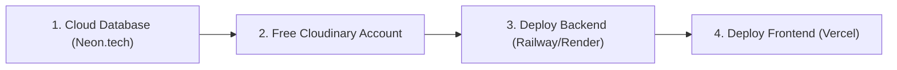

# 📖 Rentify — Complete Step-by-Step Action Guide

This guide walks you through **everything you need to do** — from running and testing the app on your computer right now, to deploying it live to the cloud, pushing to GitHub, and presenting it to your technical interviewer.

---

## 📑 Table of Contents
1. [Running the App Right Now on Your Machine](#1-running-the-app-right-now-on-your-machine)
2. [Step-by-Step Cloud Deployment (Deploying to the Internet)](#2-step-by-step-cloud-deployment)
3. [Pushing the Code to Your GitHub](#3-pushing-the-code-to-your-github)
4. [5-Minute Interview Demo Script](#4-5-minute-interview-demo-script)

---

## 1. Running the App Right Now on Your Machine

You have two simple options to run the application locally:

### Option A: Standard Local Mode (Recommended for Development)
```bash
# Terminal 1: Start Backend (Port 4000)
cd backend
mvn spring-boot:run

# Terminal 2: Start Frontend (Port 5173)
cd frontend
npm run dev
```
- Open **Frontend App:** `http://localhost:5173`
- Open **Swagger API Docs:** `http://localhost:4000/swagger-ui.html`

---

### Option B: One-Command Docker Mode
```bash
# In project root:
docker compose up -d
```
- Open **Frontend App:** `http://localhost:3000`
- Open **Swagger API Docs:** `http://localhost:4000/swagger-ui.html`
- *To stop Docker:* `docker compose down`

---

### 🔑 Demo Logins (All accounts use password: `password123`):
- `john@example.com` (Student Lender — owns Camera & Guitar)
- `jane@example.com` (Student Renter — owns Calculator & Textbook)
- `sarah@example.com` (Student — owns Road Bike)
- `admin@example.com` (Administrator — view platform statistics & reports)

---

## 2. Step-by-Step Cloud Deployment (Deploying to the Internet)

Follow these 4 simple steps to host Rentify online for free:



---

### Step 2.1: Create Free PostgreSQL Database (60 Seconds)
1. Go to [Neon.tech](https://neon.tech) and sign up (Free).
2. Click **Create Project** (Name: `rentify`).
3. Neon will display your database credentials. Keep note of:
   - **Host** (e.g. `ep-xyz.us-east-2.aws.neon.tech`)
   - **Database** (`rentify` or `neondb`)
   - **User** (`neondb_owner`)
   - **Password** (`your_password`)
   - *(Or copy the full connection string `DATABASE_URL`)*

---

### Step 2.2: Create Free Cloudinary Account (For Image Uploads)
1. Go to [Cloudinary.com](https://cloudinary.com) and create a free account.
2. In your Cloudinary Dashboard, copy:
   - **Cloud Name** (e.g. `rentify-cloud`)
   - **API Key** (e.g. `123456789012345`)
   - **API Secret** (e.g. `abcdef1234567890`)

---

### Step 2.3: Deploy Backend to Railway or Render
1. Go to [Railway.app](https://railway.app) or [Render.com](https://render.com) and log in with your GitHub.
2. Click **New Project** → **Deploy from GitHub repo** → select `Rentify`.
3. Set root directory to `backend`.
4. In the **Variables (Environment Variables)** tab, add:
   ```bash
   SERVER_PORT=4000
   DB_HOST=<your-neon-db-host>
   DB_PORT=5432
   DB_NAME=rentify
   DB_USER=<your-neon-user>
   DB_PASS=<your-neon-password>
   JWT_SECRET=404E635266556A586E3272357538782F413F4428472B4B6250645367566B5970
   APP_CORS_ALLOWED_ORIGINS=https://your-frontend.vercel.app
   CLOUDINARY_CLOUD_NAME=<your-cloud-name>
   CLOUDINARY_API_KEY=<your-api-key>
   CLOUDINARY_API_SECRET=<your-api-secret>
   ```
5. Click **Deploy**. Copy your backend live URL (e.g. `https://rentify-backend.up.railway.app`).

---

### Step 2.4: Deploy Frontend to Vercel
1. Go to [Vercel.com](https://vercel.com) and log in with GitHub.
2. Click **Add New Project** → select `Rentify`.
3. Set **Root Directory** to `frontend`.
4. In **Environment Variables**, add:
   ```bash
   VITE_API_URL=https://rentify-backend.up.railway.app/api
   ```
5. Click **Deploy**!
6. Copy your frontend URL (e.g. `https://rentify.vercel.app`) and paste it back into your backend's `APP_CORS_ALLOWED_ORIGINS` variable on Railway.

---

## 3. Pushing the Code to Your GitHub

To upload the entire project to your personal GitHub profile:

```bash
# 1. Create a new empty repository on github.com (e.g. "Rentify")

# 2. In your terminal, link your remote repository:
git remote set-url origin https://github.com/YOUR_USERNAME/Rentify.git

# 3. Push all commits to GitHub:
git push -u origin main
```

---

## 4. 5-Minute Interview Demo Script

When you present Rentify to your interviewer, follow this structure:

### 1. The 30-Second Hook:
> *"Rentify is a full-stack campus equipment sharing platform I built using Spring Boot 3.3, Java 21, React 18, and PostgreSQL. It features a strict 5-stage rental lifecycle state machine with date-overlap locking, atomic peer reputation ratings, real-time WebSockets messaging, and containerized deployment with Docker."*

### 2. Live Demo Flow (Screen Share):
1. **Catalog & Booking (`http://localhost:5173` or live URL):**
   - Log in as `jane@example.com`.
   - Browse catalog items (DSLR camera, road bike). Show date range selector with automatic inclusive pricing.
2. **Lifecycle & Reviews:**
   - Log in as `john@example.com`.
   - Show dashboard: received requests, approved bookings, active rentals.
   - Complete rental and show the **Atomic Rating Aggregation Engine** updating the owner, renter, and equipment ratings in real time.
3. **Real-Time WebSockets Chat:**
   - Open a chat thread and show how messages update live.
4. **Interactive Swagger UI (`http://localhost:4000/swagger-ui.html`):**
   - Show the interactive API documentation and demonstrate JWT Bearer authorization.
5. **Code & Tests (`cd backend && mvn clean test`):**
   - Run the test suite to show **70 passing integration tests** covering security, state machines, and concurrency.
